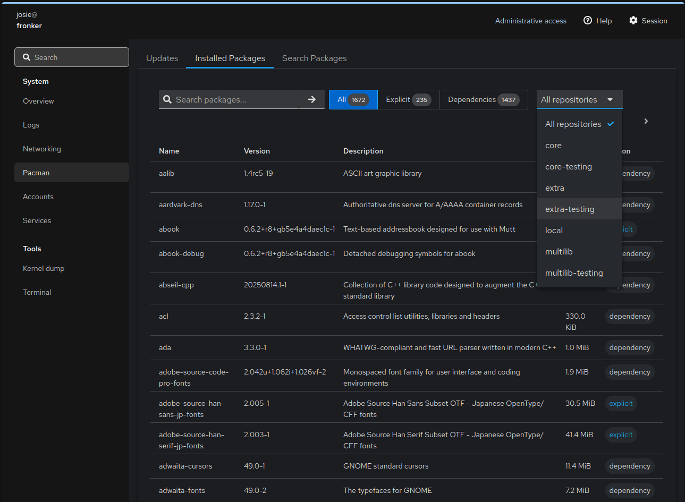
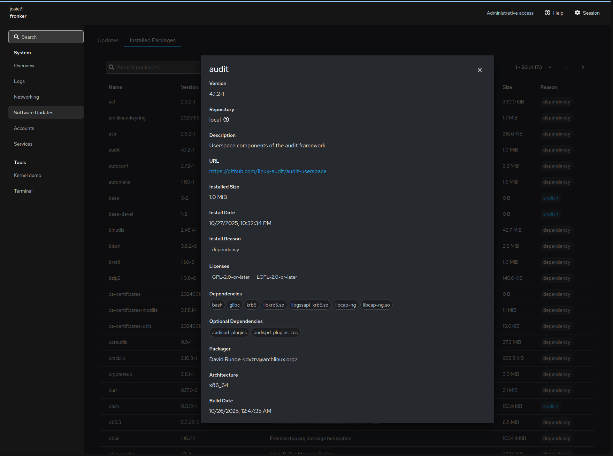
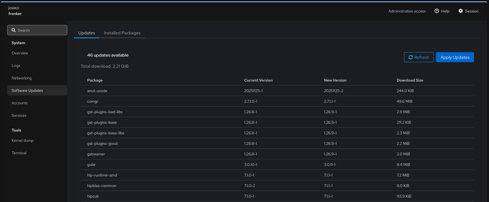
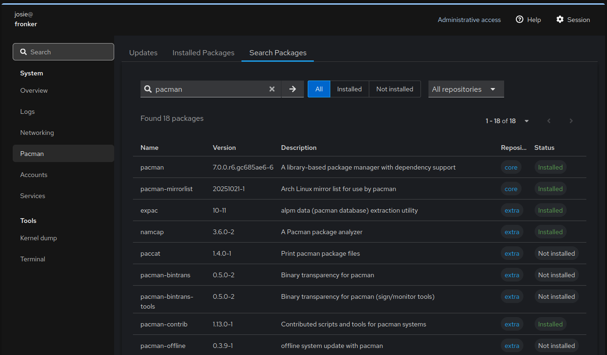

# cockpit-pacman

A Cockpit plugin for Arch Linux package management using direct alpm.rs integration.

## Features


View and search installed packages, filter by install reason (explicit/dependency) and repository


View package information


Check for and apply system updates


Search for available packages in repos

## Build

```bash
make build
```

## Install

```bash
# System-wide
sudo make install

# Development (symlinks)
make devel-install
```

## Development

```bash
make devel-install
npm run watch
```

## License

GPL-3.0
