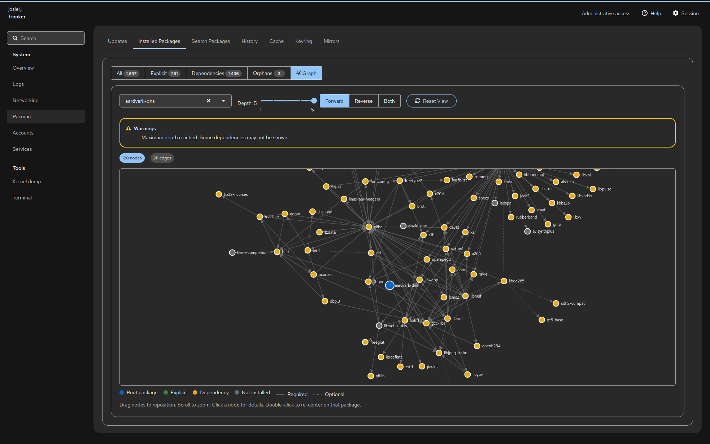
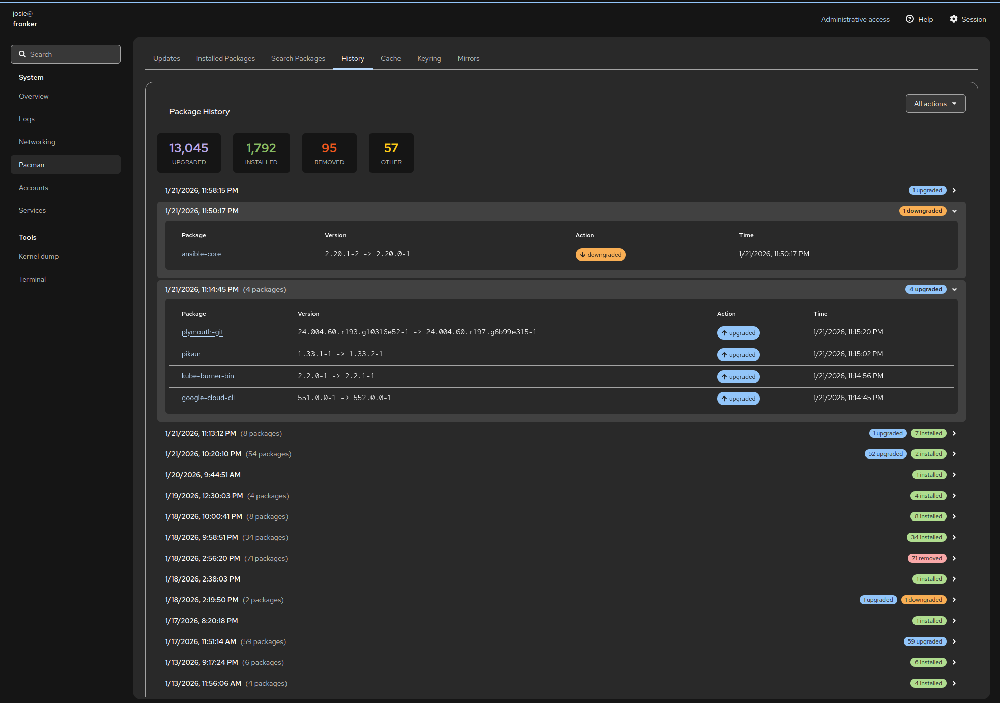
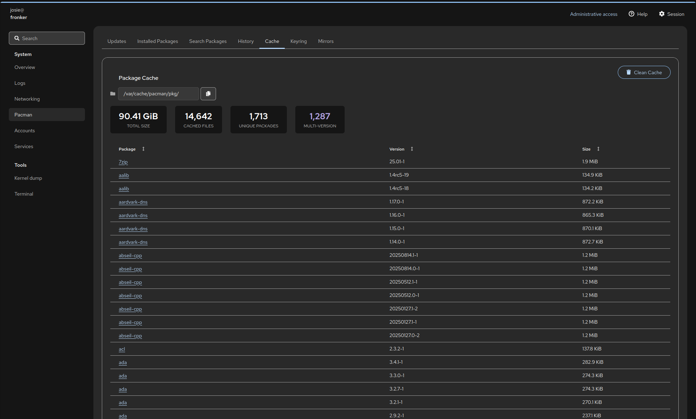

# cockpit-pacman

[](https://aur.archlinux.org/packages/cockpit-pacman)

A Cockpit plugin for Arch Linux package management using direct alpm.rs integration.

## Features


Check for updates with system overview, reboot notifications, and scheduled upgrades


Browse installed packages with filtering by install reason and repository

<details>
<summary>More screenshots</summary>


View package details with dependencies, metadata, and downgrade options


Visualize package dependency relationships


Search available packages across repositories with install status


Browse package history grouped by upgrade runs


Manage package cache with configurable cleanup


View and manage pacman keyring


Test and configure pacman mirrors

</details>

## Prerequisites

[Cockpit](https://cockpit-project.org/) must be installed and running:
```bash
sudo pacman -S cockpit
sudo systemctl enable --now cockpit.socket
```

### Optional dependencies

The plugin is self-contained for most functionality. Cache cleanup requires `paccache` from `pacman-contrib`:

```bash
sudo pacman -S pacman-contrib
```

## Installation

### From AUR (recommended)

```bash
# Using an AUR helper (e.g., paru)
paru -S cockpit-pacman

# Or manually
git clone https://aur.archlinux.org/cockpit-pacman.git
cd cockpit-pacman
makepkg -si
```

### From source

Requires Rust toolchain and npm:
```bash
sudo pacman -S rust npm
```

#### Build

```bash
make build
```

#### Install

```bash
# System-wide
sudo make install

# Development (symlinks)
make devel-install
```

## Development

```bash
make devel-install
npm run watch
```

## License

GPL-3.0
